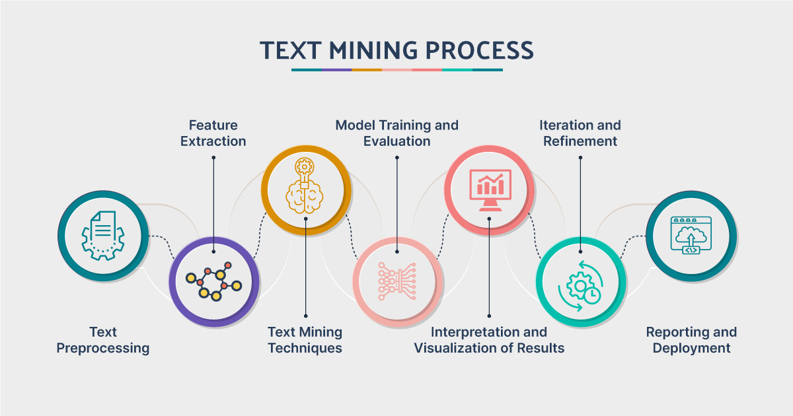
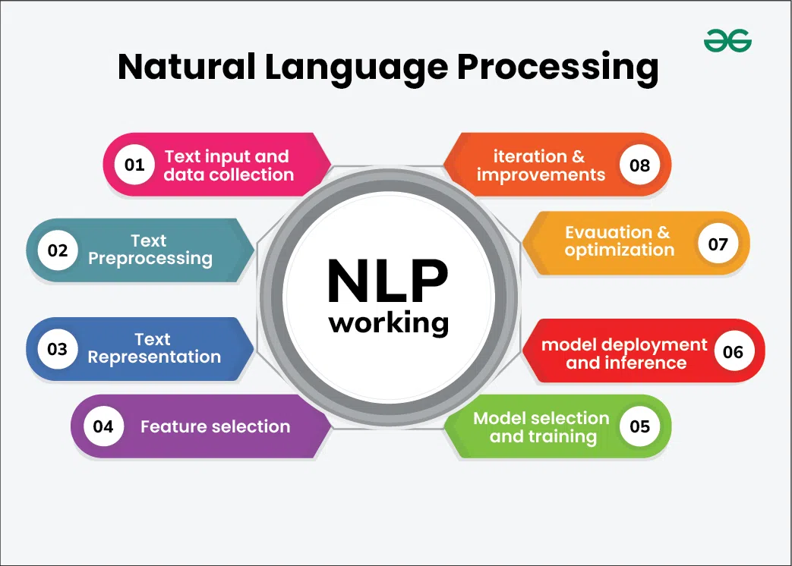

# Eye of Emergency 🚨

Développement d'un modèle d'apprentissage automatique capable de classer des tweets signalant des catastrophes naturelles réelles pour aider les intervenants d'urgence et le public à accéder à des informations précises et fiables en période de crise.

## 📋 Table des matières

- [Contexte du projet](#contexte-du-projet)
- [Données](#données)
- [Veille NLP](#veille-nlp)
- [Prérequis](#prérequis)
- [Installation](#installation)
- [Structure du projet](#structure-du-projet)
- [Méthodologie](#méthodologie)
- [Algorithmes utilisés](#algorithmes-utilisés)
- [Résultats et analyse](#résultats-et-analyse)
- [Conclusion](#conclusion)

## 🎯 Contexte du projet

L'objectif de ce projet est de développer un modèle d'apprentissage automatique capable de distinguer les tweets informatifs concernant des catastrophes naturelles réelles de ceux qui ne le sont pas. Cette classification automatique permettra d'aider les services d'urgence à identifier rapidement les informations fiables lors de situations de crise.

## 📊 Données

Le projet utilise le dataset **Disaster Tweets** qui contient les colonnes suivantes :

- **id** : Identifiant unique pour chaque tweet
- **text** : Contenu textuel du tweet
- **location** : Localisation d'où a été envoyé le tweet
- **keyword** : Mot-clé associé au tweet
- **target** : Variable cible indiquant si un tweet concerne une catastrophe réelle (1) ou non (0)

## 🧠 Veille NLP


Cette section présente une veille technologique sur les concepts fondamentaux du traitement automatique du langage naturel (NLP) et du text mining. Cette recherche théorique constitue la base méthodologique pour comprendre les techniques utilisées dans ce projet de classification de tweets d'urgence.

### 1. Text Mining vs Natural Language Processing

- 📊**Text Mining** : Processus d'extraction de connaissances et d'informations utiles à partir de grandes quantités de données textuelles non structurées. Il combine des techniques de data mining, d'apprentissage automatique et de statistiques pour découvrir des patterns, tendances et insights cachés dans les textes.

<div align="center">
  
</div>

- 🤖**NLP (Natural Language Processing)** : Branche de l'intelligence artificielle qui permet aux machines de comprendre, interpréter et générer le langage humain de manière naturelle. Le NLP se concentre sur la compréhension du sens, de la syntaxe et du contexte linguistique.

<div align="center">
  
</div>

| **Aspects** | **Text Mining** 📊 | **Natural Language Processing** 🤖 |
|--------------|-----------------|----------------------------------|
| **🎯 Objectif principal** | Extraction de patterns et d'insights à partir de volumes importants de texte | Compréhension et traitement du langage humain par les machines |
| **🔍 Focus** | Découverte de connaissances, analyse de tendances | Analyse linguistique, compréhension du sens |
| **⚙️ Méthodes** | Clustering, classification, association de règles | Analyse syntaxique, sémantique, pragmatique |
| **💼 Applications** | Business intelligence, veille stratégique, analyse de sentiment à grande échelle | Traduction automatique, chatbots, assistants vocaux |
| **📄 Données** | Corpus de textes volumineux, documents non structurés | Phrases, dialogues, textes avec structure linguistique |
| **📈 Résultats** | Rapports, visualisations, modèles prédictifs | Texte traité, entités extraites, réponses générées |

### 2. Sous-domaines du NLP
- **Analyse de sentiments** 😊😐😢 : Technique permettant d'identifier et d'extraire les opinions, émotions et attitudes exprimées dans un texte. Elle classe les textes selon leur polarité (positif, négatif, neutre) et peut détecter des émotions spécifiques (joie, colère, peur, etc.). Particulièrement utile pour analyser les réactions du public face aux catastrophes.

- **Named Entity Recognition (NER)** 🏷️ : Processus d'identification et de classification des entités nommées dans un texte (personnes, lieux, organisations, dates, montants, etc.). Dans le contexte des tweets d'urgence, le NER peut extraire des informations cruciales comme les lieux de catastrophes, les organisations de secours impliquées, ou les dates d'événements.

- **Part-of-Speech (POS) Tagging** 📝 : Attribution d'une catégorie grammaticale (nom, verbe, adjectif, etc.) à chaque mot d'un texte. Cette analyse syntaxique aide à comprendre la structure grammaticale et peut améliorer la précision d'autres tâches NLP comme la classification de texte.

### 3. Applications concrètes du NLP

Le NLP trouve de nombreuses applications dans notre quotidien et dans des domaines spécialisés :

- **🔍 Moteurs de recherche** : Google, Bing utilisent le NLP pour comprendre les requêtes utilisateur et fournir des résultats pertinents
- **🤖 Assistants virtuels** : Siri, Alexa, Google Assistant comprennent et répondent au langage naturel
- **🌐 Traduction automatique** : Google Translate, DeepL permettent la traduction en temps réel
- **📧 Filtrage de spam** : Classification automatique des emails indésirables
- **💬 Chatbots** : Service client automatisé, support technique
- **📰 Résumé automatique** : Génération de résumés d'articles ou de documents
- **🚨 Détection de fake news** : Identification de fausses informations
- **📊 Analyse de réseaux sociaux** : Monitoring de l'opinion publique, détection de tendances
- **⚕️ Analyse médicale** : Traitement de dossiers patients, aide au diagnostic

### 4. Stop-words
- **Définition** 🛑 : Mots très fréquents dans une langue qui n'apportent généralement pas d'information sémantique significative pour l'analyse textuelle. Ces mots de liaison, articles, prépositions et pronoms sont souvent filtrés lors du préprocessing pour se concentrer sur les mots porteurs de sens.

- **Importance de leur suppression** ✂️ : 
  - **Réduction du bruit** : Élimination des mots non informatifs qui peuvent masquer les patterns importants
  - **Amélioration des performances** : Réduction de la dimensionnalité et accélération des calculs
  - **Focus sur le contenu** : Concentration sur les mots clés porteurs de sens
  - **Optimisation mémoire** : Diminution de l'espace de stockage nécessaire

- **Exemples** 📝 :
  - **Français** : le, la, les, de, du, des, et, ou, à, dans, pour, sur, avec, sans, être, avoir, faire...
  - **Anglais** : the, a, an, and, or, but, in, on, at, to, for, of, with, by, from, is, are, was, were...
  - **Contexte spécifique** : Dans l'analyse de tweets, on peut aussi considérer comme stop-words : "RT", "@", "http", emojis selon le contexte

### 5. Traitement des caractères spéciaux et ponctuation

Le nettoyage des caractères spéciaux et de la ponctuation est une étape cruciale du préprocessing textuel :

**🔧 Techniques principales :**
- **Suppression de la ponctuation** : Élimination des signes de ponctuation (.,!?;:) qui peuvent créer du bruit
- **Normalisation des caractères** : Conversion des caractères accentués (é → e, à → a) pour uniformiser
- **Gestion des caractères spéciaux** : Traitement des symboles (@, #, $, %, &) selon le contexte
- **Nettoyage des espaces** : Suppression des espaces multiples, tabulations, retours à la ligne

**📱 Spécificités des réseaux sociaux :**
- **Hashtags** : Conservation ou suppression du # selon l'analyse souhaitée
- **Mentions** : Traitement des @ mentions (@utilisateur)
- **URLs** : Suppression ou remplacement par un token générique
- **Emojis** : Conservation, suppression ou conversion en texte selon le besoin
- **Caractères répétés** : Normalisation ("wouuuuu" → "wouu")

**⚖️ Équilibre nécessaire :**
Il faut trouver le bon équilibre entre nettoyage et conservation de l'information utile. Par exemple, les points d'exclamation peuvent indiquer l'urgence dans les tweets de catastrophe.

### 6. Tokenisation et N-grams

- **Token** 🪙 : Unité linguistique de base obtenue après découpage d'un texte. Un token peut être un mot, un caractère, ou même une sous-partie de mot selon la méthode de tokenisation choisie. C'est l'élément atomique manipulé par les algorithmes de NLP.

- **N-gram** 🔗 : Séquence contiguë de N éléments (mots, caractères, ou tokens) extraite d'un texte. Les n-grams capturent le contexte local et les relations entre mots adjacents :
  - **Unigram (1-gram)** : Mots individuels ["catastrophe", "naturelle"]
  - **Bigram (2-gram)** : Paires de mots ["catastrophe naturelle", "secours d'urgence"]
  - **Trigram (3-gram)** : Triplets de mots ["catastrophe naturelle majeure"]

- **Processus de tokenisation** ⚙️ :
  1. **Segmentation** : Découpage du texte brut en unités plus petites
  2. **Normalisation** : Conversion en minuscules, suppression d'accents
  3. **Filtrage** : Suppression des stop-words, caractères spéciaux
  4. **Validation** : Vérification de la cohérence des tokens obtenus
  
  **Exemple** : "Les secours arrivent !" → ["les", "secours", "arrivent"] → ["secours", "arrivent"] (après suppression stop-words)

### 7. Stemming vs Lemmatisation

- **Stemming** ✂️ : Processus de réduction des mots à leur racine (stem) en supprimant les suffixes et préfixes selon des règles algorithmiques. Rapide mais parfois imprécis, il peut produire des stems qui ne sont pas des mots réels.
  - **Exemple** : "courir", "courant", "couraient" → "cour"

- **Lemmatisation** 🎯 : Processus de réduction des mots à leur forme canonique (lemme) en utilisant un dictionnaire et une analyse morphologique. Plus précise que le stemming, elle produit toujours des mots existants.
  - **Exemple** : "courir", "courant", "couraient" → "courir"

**🔍 Différences principales :**

| **Aspect** | **Stemming** | **Lemmatisation** |
|------------|--------------|-------------------|
| **🚀 Rapidité** | Très rapide | Plus lente |
| **🎯 Précision** | Moins précise | Plus précise |
| **📚 Ressources** | Règles algorithmiques | Dictionnaire + analyse grammaticale |
| **✅ Résultat** | Stem (peut ne pas être un mot) | Lemme (toujours un mot valide) |
| **🔧 Complexité** | Simple | Complexe |

**🎪 Cas d'usage :**
- **Stemming** : Recherche d'information, classification de texte où la vitesse prime
- **Lemmatisation** : Analyse sémantique fine, applications nécessitant une haute précision
- **Projet Emergency** : Le stemming peut suffire pour la classification de tweets d'urgence où la rapidité est cruciale

### 8. Méthodes de vectorisation

- **Bag of Words (BoW)** 🎒 : Représentation vectorielle qui compte la fréquence d'apparition de chaque mot dans un document, sans tenir compte de l'ordre des mots. Chaque document devient un vecteur où chaque dimension correspond à un mot du vocabulaire.
  
  **Exemple :**
  - Vocabulaire : ["incendie", "forêt", "secours", "urgent"]
  - Document : "Incendie de forêt urgent" → [1, 1, 0, 1]
  
  **✅ Avantages :** Simple, rapide, efficace pour la classification
  **❌ Inconvénients :** Perte du contexte, vecteurs très creux (sparse)

- **TF-IDF (Term Frequency-Inverse Document Frequency)** 📊 : Méthode de pondération qui mesure l'importance d'un mot dans un document relativement à une collection de documents. Combine la fréquence du terme (TF) avec l'inverse de sa fréquence dans le corpus (IDF).

  **📐 Formules :**
  - **TF(t,d)** = (Nombre d'occurrences de t dans d) / (Nombre total de mots dans d)
  - **IDF(t,D)** = log(Nombre total de documents / Nombre de documents contenant t)
  - **TF-IDF(t,d,D)** = TF(t,d) × IDF(t,D)

  **✅ Avantages :** Réduit l'impact des mots très fréquents, met en valeur les mots discriminants
  **❌ Inconvénients :** Plus complexe, ne capture pas les relations sémantiques
  
  **🎯 Usage dans le projet :** TF-IDF sera particulièrement utile pour identifier les mots-clés spécifiques aux tweets de catastrophe par rapport aux tweets normaux.

### 9. Bagging vs Boosting

- **Bagging (Bootstrap Aggregating)** 🎒 : Technique d'ensemble qui entraîne plusieurs modèles en parallèle sur des échantillons différents des données d'entraînement (avec remise). Les prédictions finales sont obtenues par vote majoritaire (classification) ou moyenne (régression). Réduit la variance et limite l'overfitting.
  
  **Exemples :** Random Forest, Extra Trees
  **Principe :** Diversité par échantillonnage des données

- **Boosting** 🚀 : Technique d'ensemble qui entraîne les modèles séquentiellement, où chaque nouveau modèle apprend des erreurs du précédent. Les modèles faibles sont combinés pour former un modèle fort. Réduit le biais et améliore la précision.
  
  **Exemples :** AdaBoost, Gradient Boosting, XGBoost
  **Principe :** Amélioration itérative en se concentrant sur les erreurs

**🔍 Comparaison :**

| **Aspect** | **Bagging** 🎒 | **Boosting** 🚀 |
|------------|----------------|------------------|
| **🔄 Entraînement** | Parallèle (indépendant) | Séquentiel (dépendant) |
| **🎯 Objectif** | Réduire la variance | Réduire le biais |
| **⚡ Vitesse** | Plus rapide (parallélisable) | Plus lent (séquentiel) |
| **🎪 Robustesse** | Résistant au bruit | Sensible au bruit/outliers |
| **📊 Performance** | Stable, bonne généralisation | Très haute performance si bien calibré |
| **🔧 Complexité** | Simple à implémenter | Plus complexe |

**🎯 Usage dans le projet :** Random Forest (bagging) pour la robustesse et XGBoost (boosting) pour la performance maximale seront comparés dans ce projet.

## 🔧 Prérequis

- Python 3.7+
- Jupyter Notebook
- Bibliothèques Python : pandas, numpy, scikit-learn, nltk, matplotlib, seaborn ... 

## 🚀 Installation

```bash
# Cloner le repository
git clone https://github.com/pierre-mazard/eye-of-emergency.git
cd eye-of-emergency

# Installer les dépendances
pip install -r requirements.txt

# Lancer Jupyter Notebook
jupyter notebook
```

## 📁 Structure du projet

```
eye-of-emergency/
├── assets/
│   ├── images/                        # Images pour la documentation (README, etc.)
│   └── README.md                      # Documentation des ressources visuelles
├── data/
│   ├── raw/
│   │   └── disaster_tweets.csv        # Dataset brut original
│   ├── train.csv                      # Dataset d'entraînement préprocessé
│   ├── test.csv                       # Dataset de test préprocessé
│   └── README.md                      # Documentation du dossier data
├── notebooks/
│   └── eye_of_emergency_analysis.ipynb 
├── src/
│   ├── preprocessing.py
│   └── models.py
├── results/
│   ├── figures/
│   │   └── README.md                  # Documentation des visualisations
│   └── models/
│       └── README.md                  # Documentation des modèles sauvegardés
├── requirements.txt
└── README.md
```

## 🔍 Méthodologie

### 1. Veille NLP
Étude des concepts fondamentaux du traitement du langage naturel

### 2. Exploration des données
- Analyse des données manquantes et doublons
- Visualisations spécifiques au NLP (nuages de mots, distribution des longueurs, etc.)

### 3. Préprocessing
- Nettoyage des données textuelles
- Pipeline de preprocessing personnalisé

### 4. Modélisation
- Développement et comparaison de 5 modèles
- Optimisation par GridSearch

### 5. Évaluation
- Métriques d'évaluation avec optimisation du F1-score

## 🤖 Algorithmes utilisés

### Modèles de classification étudiés

1. **Régression Logistique**
   - [À compléter]

2. **Decision Tree**
   - Implémentation d'une classe Python personnalisée
   - [À compléter]

3. **Random Forest**
   - [À compléter]

4. **XGBoost**
   - [À compléter]

5. **Support Vector Machine (SVM)**
   - [À compléter]

## 📈 Résultats et analyse

### Analyse exploratoire des données
- **Données manquantes** : [À compléter]
- **Doublons** : [À compléter]
- **Visualisations NLP** : [À compléter - nuages de mots, distribution des longueurs, etc.]

### Performance des modèles
- **Meilleur modèle** : [À compléter]
- **Métriques d'évaluation** :
  - **Accuracy** : [À compléter]
  - **Precision** : [À compléter]
  - **Recall** : [À compléter]
  - **F1-score** : [À compléter]
- **Matrice de confusion** : [À compléter]
- **Rapport de classification** : [À compléter]

## 🎯 Conclusion

### Comparaison des modèles
[À compléter - analyse comparative des 5 modèles]

### Modèle sélectionné
[À compléter - justification du choix final]

### Efficacité et performance
[À compléter - évaluation de l'efficacité du modèle choisi] 

